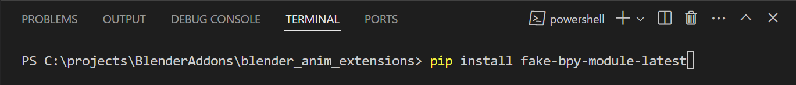

# Blender Anim Extensions 

Some handy extensions for animating within Blender.

## Dev Environment Setup (for making new add-ons) 

Install these:

1. [Visual Studio Code](https://code.visualstudio.com/)
2. [Python v3.12+](https://www.python.org/downloads/)
2. [Blender v4.2+](https://www.blender.org/download/)

Then install the following extensions within VS Code:

- [Python](https://marketplace.visualstudio.com/items?itemName=ms-python.python)
- [Python Debugger](https://marketplace.visualstudio.com/items?itemName=ms-python.debugpy)
- [Pylance](https://marketplace.visualstudio.com/items?itemName=ms-python.vscode-pylance)
- [Blender Development](https://marketplace.visualstudio.com/items?itemName=JacquesLucke.blender-development) 

Finally, install the "Fake Blender Python API" module for autocomplete and docs:

    pip install fake-bpy-module-latest

> **NOTE** It's safest to run this command in the Terminal within VS Code, like this:
>
> 

### Usage

Follow the docs for the [Blender Development](https://marketplace.visualstudio.com/items?itemName=JacquesLucke.blender-development) extension for info on creating new add-ons, connecting a debugger, and iterating. It's a really great extension!
